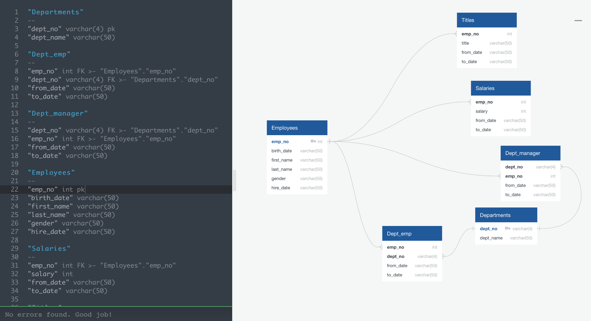

# Employee Database

* Research project on employees of a corporation from the 1980s and 1990s. 
* Analysis of databases of employees.

###  1. Data Modeling
* Inspection of CSV's and sketching out an ERD of the tables [http://www.quickdatabasediagrams.com](http://www.quickdatabasediagrams.com) 
* 
###  2. Data Engineering
* Designing the tables to hold data in the CSV's (with PK and FK)
* Import the CSV's into a SQL database to make analysis
* Import at the end tables with foreign keys (FK)
###  3. Data Analysis

